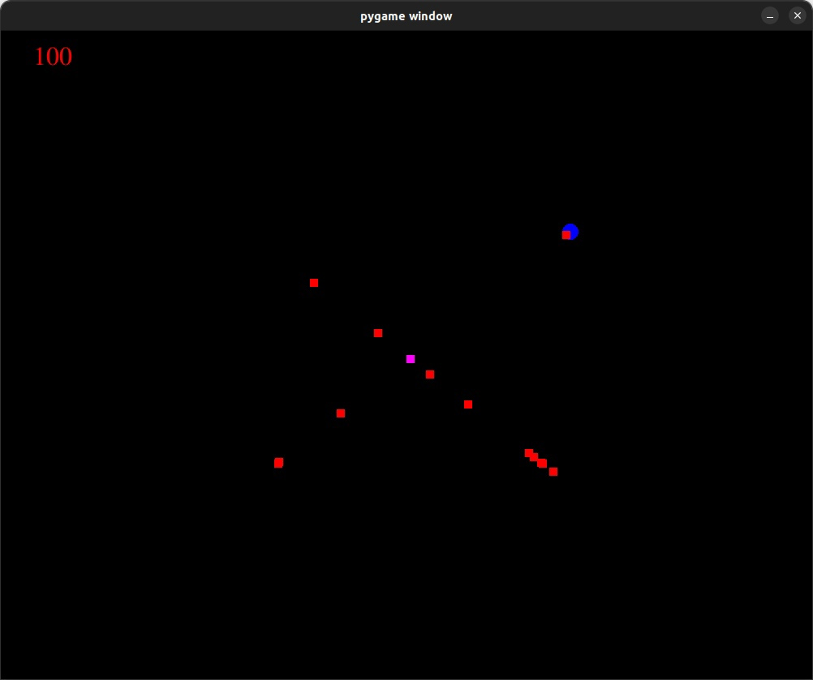

# Игрулька с квадратиками




## RU

### Запуск
```curl -sSL https://install.python-poetry.org | python3 -```

```poetry install```

```poetry run python game.py```  

Так же для пользователей windows доступен exe файл в папке WIN.  
Для пользователей Linux доступен исполняемый файл в папке LINUX.

### Геймплей

Игрок играет за белый квадрат, появляющийся в центре экрана, главная задача игры уничтожить всех противников (красные квадраты).  
Каждые 10 секунд противники превращаются в зеленые и их можно поедать увеличивая свои очки.   
В случайные промежутки времени квадраты превращаются в синие круги "предупреждая" игрока о готовящемся рывке, спустя некоторое время синий шар совершит короткий рывок в направлении персонажа.  
Игрок имеет возможность включить щит, защищая себя от атак красных квадратов, отбрасывая их и кратковременно оглушая, тем самым получая возможность съесть их, так же щит отменяет готовящийся рывок синих шаров, превращая их в обычные квадраты, в момент рывка синего шара возможно "парирование", то есть уничтожение шара и получение краткосрочной неуязвимости.  
Получив неуязвимость игрок отбрасывает касающихся его противников, подобно щиту, но оглушая на более продолжительное время.

### Управление

WASD - Движение  
LShift/RShift/Space - Рывок  
Q/Right Arrow - Щит


## EN
 ### Launch
```curl -sSL https://install.python-poetry.org | python3 -```  
```poetry install```  
```poetry run python game.py```  

Alternatively for windows user you can launch the game with the executable in WIN directory.  
For linux you can launch the game with the executable in LINUX directory.

### Gameplay
The player controls a white square that appears in the center of the screen, the main objective of the game is to destroy all enemies (red squares).  
Every 10 seconds, enemies turn green and can be eaten to increase your score.  
At random intervals, squares turn into blue circles, warning the player of an upcoming rush.  
After a while, the blue ball will make a short dash towards the player. The player can activate a shield, protecting themselves from red square attacks, repelling them and temporarily stunning them, allowing the player to eat them. The shield also cancels the upcoming rush of blue balls, turning them into regular squares.  
In the moment of the blue ball's rush, there is a possibility of a "parry", which means destroying the ball and gaining temporary invulnerability.  
After receiving invulnerability, the player repels any enemies touching them, similar to the shield, but they are stunned for a longer time.

### Controls
WASD - Movement  
LShift/RShift/Space - Dash  
Q/Right Arrow - Shield

